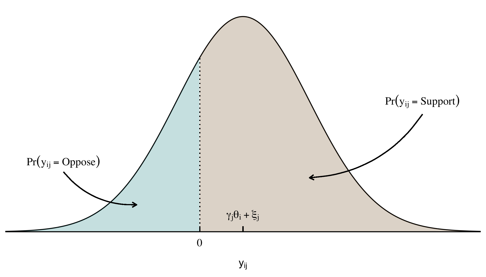

# Ideal Point Estimation with 99% Missing Data


Item-Response Theory (IRT) models are frequently used in political
science to estimate the latent ideology, or ideal point, of various
political actors (most commonly legislators). The model takes observed
actions (such as votes on bills) as inputs, and then outputs a posterior
distribution for where each actor’s ideal point lands on a left-right
scale. The traditional IRT model formulation is shown in
<a href="#eq-irt" class="quarto-xref">Equation 1</a>.

<span id="eq-irt">$$
\begin{aligned}
  \text{Pr}(y_{ij} = \text{Support}) &= \Phi(\gamma_j\theta_i + \xi_j)
\end{aligned}
 \qquad(1)$$</span>

Where

- $y_{ij}$: actor $i$’s vote (support/oppose) on bill $j$
- $\theta_i$: the actor’s ideal point
- $\gamma_j$: the ideological component of the bill
- $\xi_j$: the non-ideological component of the bill

<div id="fig-irt">



Figure 1: Traditional IRT Model

</div>

<a href="#fig-irt" class="quarto-xref">Figure 1</a> shows the
probabilistic representation of
<a href="#eq-irt" class="quarto-xref">Equation 1</a> using the standard
normal CDF link, $\Phi$.

## Accounting for Abstentions

Some tricky model identification issues aside, the traditional IRT model
does a pretty good job recovering ideal points when most actors vote on
most bills. But if there is a high rate of abstentions (e.g. missing
data), things start to fall apart.

In my [dissertation
paper](https://github.com/bwilden/abstention-ideal/blob/main/paper.pdf)
for this project I develop a new IRT model to account for high rates of
missing data. The new model is essentially an ordered-probit with an
extra parameter, $\tau_i$ for each actor which represents their
“indifference” towards taking support/oppose positions
(<a href="#eq-irt-tau" class="quarto-xref">Equation 2</a> and
<a href="#fig-irt-abs" class="quarto-xref">Figure 2</a>).

<span id="eq-irt-tau">$$
\begin{aligned}
   \text{Pr}(y_{ij} = \text{Support}) &= \Phi(\gamma_j\theta_i + \xi_j - \tau_i) \\
   \text{Pr}(y_{ij} = \text{Abstain}) &= \Phi(\tau_i - (\gamma_j\theta_i + \xi_j)) - \Phi(-\tau_i - (\gamma_j\theta_i + \xi_j)) \\
   \text{Pr}(y_{ij} = \text{Oppose}) &= 1 - \Phi(\gamma_j\theta_i + \xi_j + \tau_i) 
\end{aligned}
 \qquad(2)$$</span>

<div id="fig-irt-abs">


Figure 2: Abstention IRT Model

</div>

Larger values of $\tau$ implies a higher likelihood that an actor will
abstain on any particular bill.

I code this model in the Bayesian modeling package
[brms](https://paulbuerkner.com/brms/) in R using actor-specific
thresholds. The $\theta$, $\gamma$, and $\xi$ parameters are all modeled
hierarchically using the `(1 | id)` syntax from brms.

``` r
abstention_formula <- bf(
  position | thres(gr = actor_id) ~ gamma * theta + xi,
  theta ~ (1 | actor_id),
  gamma ~ (1 | bill_id),
  xi ~ (1 | bill_id),
  nl = TRUE
)
abstention_family <- brmsfamily("cumulative", "probit")
```

## Simulation Study

I simulate data with increasing amounts of missingness
(i.e. abstentions) to test how well each IRT model recovers the true
parameter values. By comparing the true ideal point values on the x-axis
with the estimated ideal point values on the y-axis we can see that
under low-to-moderate amounts of missingness, both the Abstention model
and the traditional IRT models do a decent job. However, at about 90%
missing data and above, the traditional model fails to accurately
recover the simulated ideal points—whereas the Abstention model’s
predictions remain relatively close to the 45 degree identity line.[^1]

<div class="panel-tabset">

## 18.9% Missing Data


## 46.3% Missing Data


## 74% Missing Data


## 90.2% Missing Data


## 96.2% Missing Data


</div>

## Notes

- Full paper:
  [paper.pdf](https://github.com/bwilden/abstention-ideal/blob/main/paper.pdf)
- R code and cleaning steps:
  [\_targets.R](https://github.com/bwilden/abstention-ideal/blob/main/_targets.R)
  and [R files](https://github.com/bwilden/abstention-ideal/tree/main/R)

[^1]: The *99%* in the project title comes from an application where I
    test my model against federal interest group lobbying data, which
    has an abstention rate of around 99.9%. See the full paper for more
    details.
