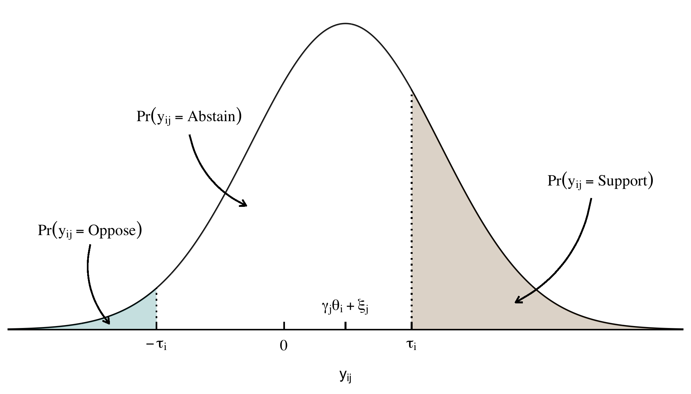
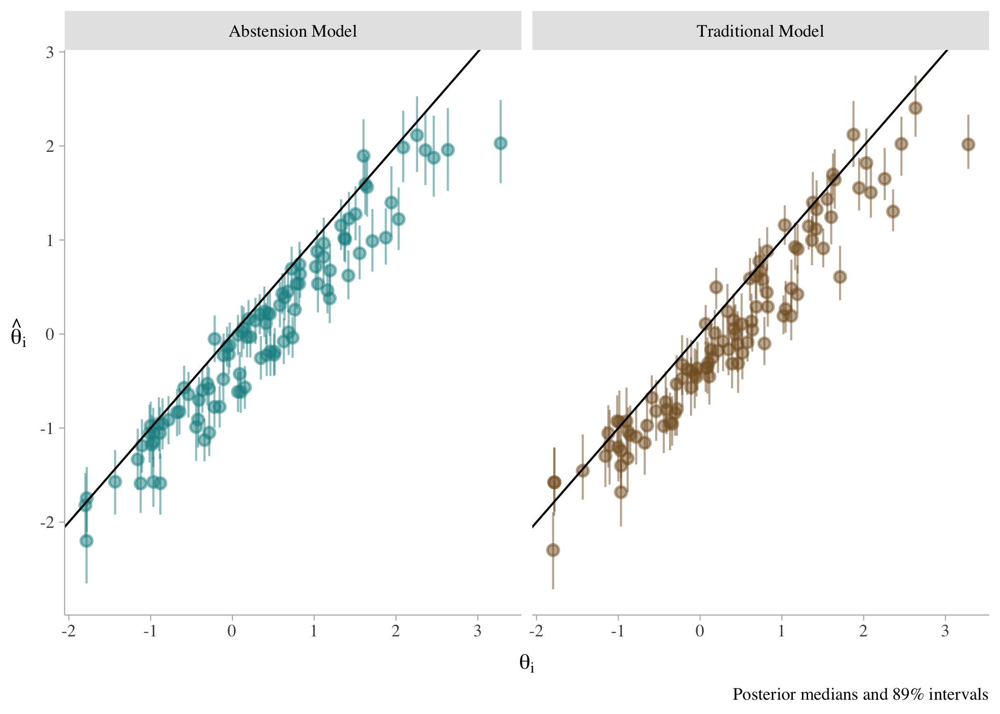

# Ideal Point Estimation with 99% Missing Data

$$
\begin{aligned}
  \text{Pr}(y_{ij} = \text{Support}) &= \Phi(\gamma_j\theta_i + \xi_j)
\end{aligned}
 \qquad(1)$$

Figure 1: Binary IRT Model

$$
\begin{aligned}
   \text{Pr}(y_{ij} = \text{Support}) &= \Phi(\gamma_j\theta_i + \xi_j - \tau_i) \\
   \text{Pr}(y_{ij} = \text{Abstain}) &= \Phi(\tau_i - (\gamma_j\theta_i + \xi_j)) - \Phi(-\tau_i - (\gamma_j\theta_i + \xi_j)) \\
   \text{Pr}(y_{ij} = \text{Oppose}) &= 1 - \Phi(\gamma_j\theta_i + \xi_j + \tau_i) 
\end{aligned}
 \qquad(2)$$

Figure 2: Abstention IRT Model

# Simulation Study

## 1

## 2

## 3

## 4

## 5

# Replication

